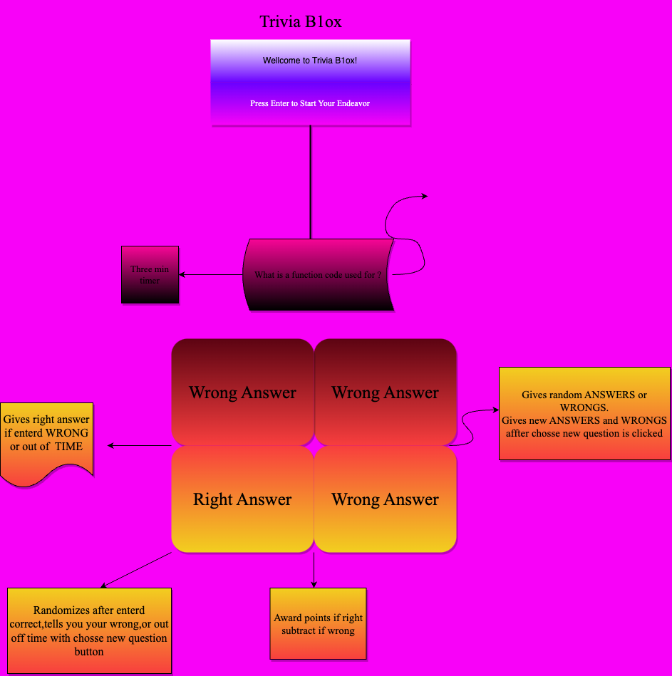

# Trivia B1oxg
 ---
## Unleash Your Knowlage Triva Knows No Bounds

"WELCOME to TRIVIA BL0X! UNLEASH your inner code breaker! In a grit and grid of Html,JavaScript,and Css, only one box holds the correct answer.Are you ready to Conquer the Challenge and prove your Tech prowess? DARE to endeavor the TRIVIA B1ox challenge!!!

#### How to play
How to play Trivia B1ox First Click begin you endeavor to get the the questions to pop up read It and click on a box that you think holds the correct answers if you get the right answer you get green if you get red its the incorrect answer and the cycle repeats itself ect.
---
### MVP Goals

* Set browser tag name to trivia.
* build a html,javascript,and css browser game.
* Render a start screen that begins with the text Begin Your Endeavor. 
* Once clicked It should load pick and load a random question.
* Set a Three minute for each randomized question.
* Render 2*2 grid of squares with three wrong answers and one right answer.
* Maybe implement a health bar that takes damage when wrong answer is clicked.

---
#### Stretch Goals
    1. Maybe implement a health bar that takes damage when wrong answer is clicked.
    2. Give random questions and Answers after each round .
    3. Use a Timer for each question.

---
##### Tech stacks
    Tech stacks I plan on using are HTML ,Mostly JavaScript,and some css.
##### Wire Frame 

##### Potential Road-blocks
    1.Starting off the code.
    2.Snyntax Errors.
    3.Problem solving.
    4.Game Bugs.
    5.Getting stuck on a problem.
    6.using JavaScript.
    7.Need help on most things ?
#### Current Road Blockes
    Some Road Blocks I am currently facing include my background  image not loading and grid items are formated diffrently from text browser and not being able generate the correct list of answers for 
#### Proud Parts 
     When I was got my grid items to show up in my web browser I was very excited but was more impressed when I was able to implement my grid items answsers to change colors for the worng answers or correct answers green for correct and red for incorrect.Getting diffrent question to be generated when button is clicked.